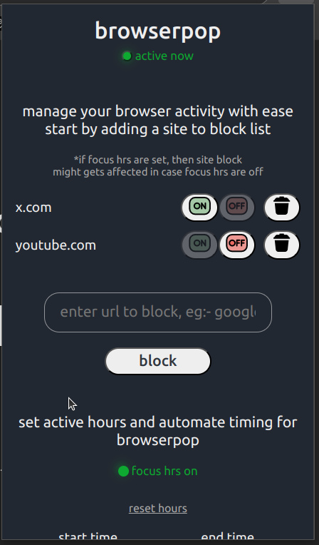
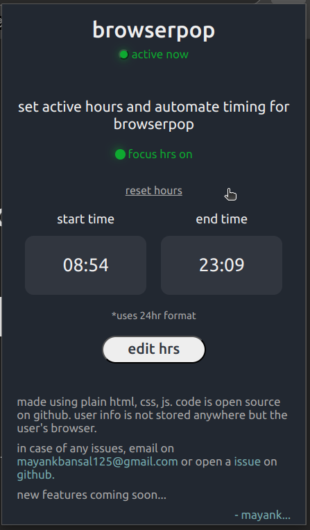
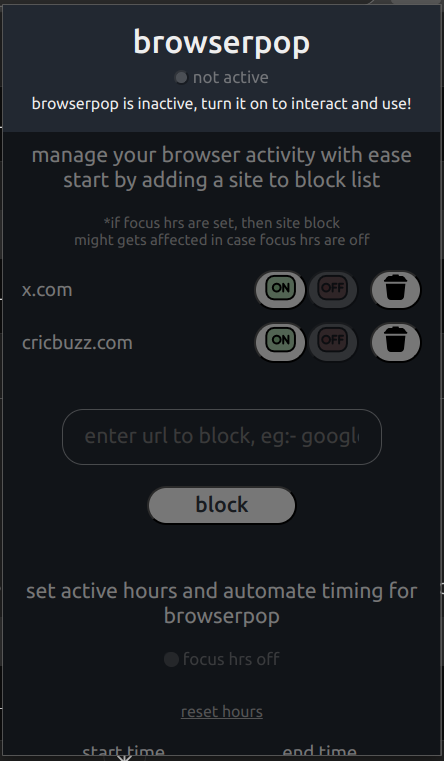

# BrowserPop

browserpop extension can be used to block out the websites, keeping you focused on your tasks. use focus hours to schedule the timing for the block and keep your distractions in check.

## Extension Installation/Setup
- Visit the [website](https://browser-pop.vercel.app/) and download the .zip file. Alternatively, the zip file can also be downloaded from the github [repo](https://github.com/MayankBansal12/browser-pop) or using this [link](https://github.com/MayankBansal12/browser-pop/archive/refs/heads/main.zip)
- Extract the download .zip file and ensure the same code structure as in the [repo](https://github.com/MayankBansal12/browser-pop)
- Visit your browser settings, enable developer mode, and install from other sources to unpack the downloaded extension files.
- Once developer mode is enabled, extension files can be uploaded using 'load unpacked' or similar settings as per your browser.
- Extension should be added in your browser by now. Feel free to contact in case you face any issues or errors during installation or usage.

(Note:- Remember not to delete the extracted folder 'browser-pop-main' as it is what displays the content in your browser. You can also edit the HTML and CSS to improve the design or play around with JavaScript.)

## Features
- Easy blocking :- Add the website URL you want to block
- Simple Toggle on/off :- Toggle the blocking behaviour to on/off easily
- Set Focus Hours :- Set focus hours in case you want to set specific timings for blocking the added websites
- Toggle Extension on/off :- Set the extension to active or inactive with one simple click to switch it off or on when needed easily.

(features like browsing time tracking, activity analysis coming soon...)

view the extension code [here](https://github.com/MayankBansal12/browser-pop)

## Technologies Used
Plain HTML, CSS, and JS were used for extension setup, and Next.js and Shadcn were used to design the landing page/website.
  
## Screenshots

#### notes
- extension is currently not available on chrome web store 
- current version only supports blocking the websites and setting focus hours with more features to come soon
- if you have new feature requests or bug reports, you can open a issue on github or send an email on [mayankbansal125@gmail.com](mailto:mayankbansal125@gmail.com) or a [dm](https://x.com/SimplerMayank) on twitter/x.

---
